Projekt zawiera odwzorowanie gry Candy Crush

Aby włączyć apliakcji użyj poniższej komendy
```
flutter run -d chrome --web-port 5000
```

[Trello](https://trello.com/invite/b/Lg2K48P7/ATTIc5298440becb359fd194575e22dbe6012A9BD5C1/to-do)

# Użyte technologie
- Flutter
- Firebase

# Mockupy interfejsów
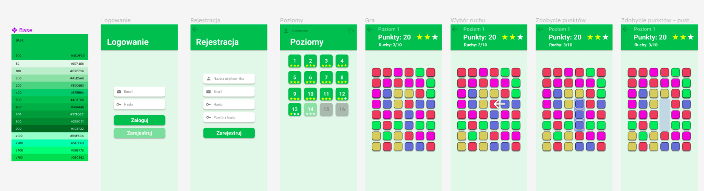

# Schematy architektury

## Schemat modeli danych
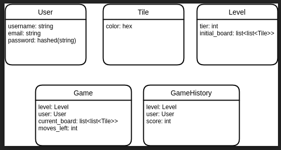

## Diagram przypadków użycia
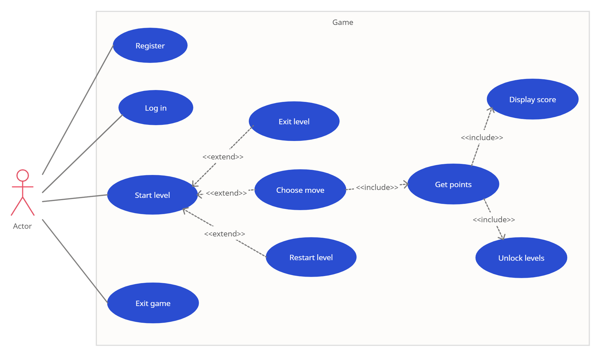

# Testy manualne

### Scenariusz 1: Nowy użytkownik loguje się do aplikacji

#### 1.1 Użytkownik jest niezalogowany
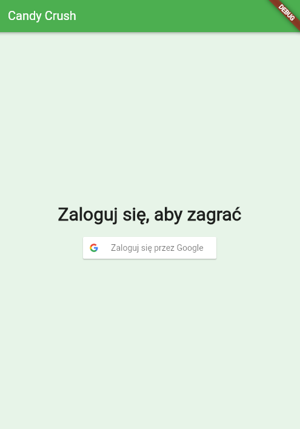
#### 1.2 W bazie danych nie ma żadnych rekordów
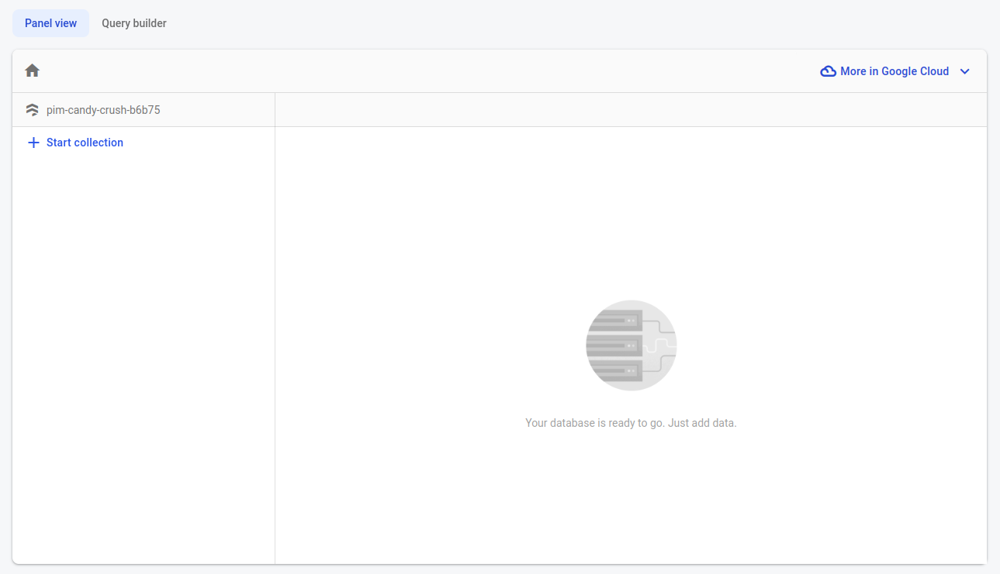
#### 1.3 Użytkownik się loguje
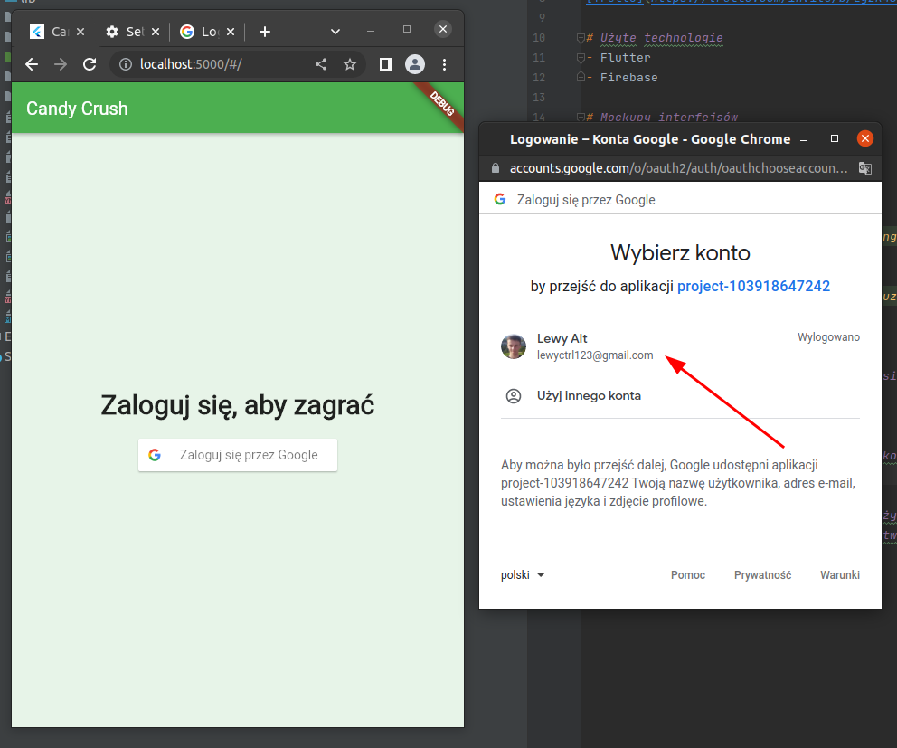
#### 1.4 Lista leveli wyświetla się dla użytkownika poprawnie
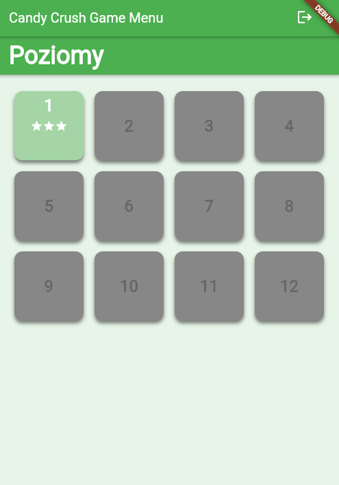
#### 1.5 Rekordy w bazie danych zostały utworzone
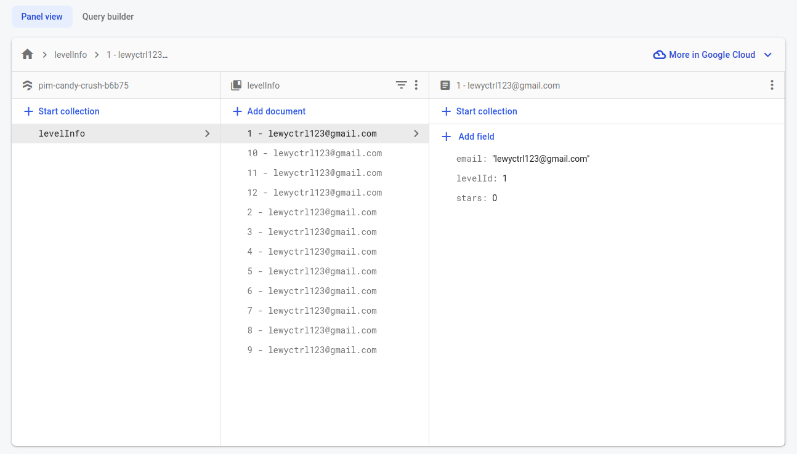

### Scenariusz 2: Użytkownik zalicza poziom na większą liczbę gwiazdek niż miał wcześniej
#### 2.1 Użytkownik zaliczył poziom na większą liczbę gwiazdek niż miał wcześniej
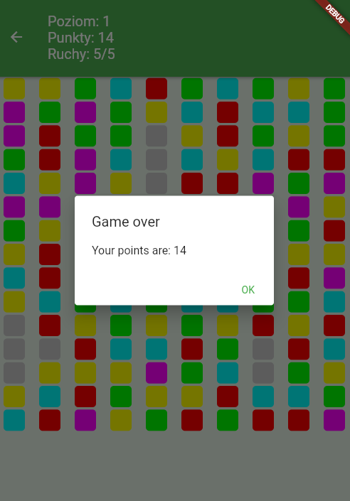
#### 2.2 Widok się automatycznie odświeżył: pojawił się nowy wynik i następny level został odblokowany

#### 2.3 Rekordy w bazie danych zostały zaktualziowane
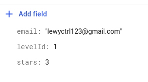

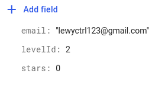


### Scenariusz 3: Użytkownik zalicza poziom na mniejszą lub równą liczbę gwiazdek niż miał wcześniej
#### 3.1 Użytkownik ma zaliczony poziom na 0 gwiazdek
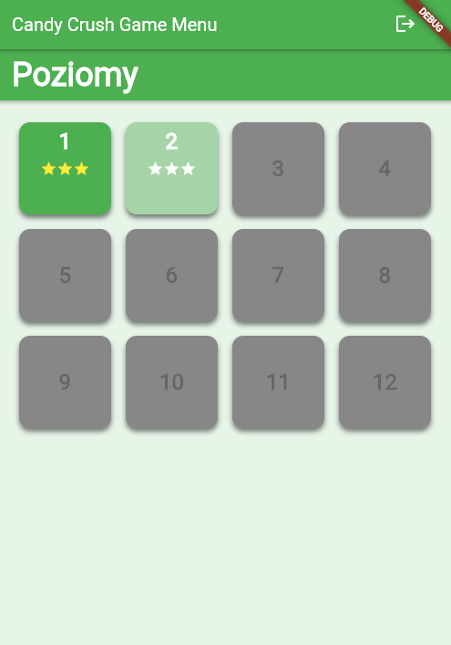
#### 3.2 Użytkownik zaliczył poziom na 0 gwiazdek(mniej niż 5 pkt)
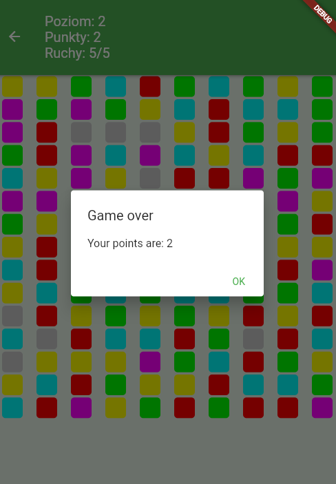
#### 3.3 Widok się nie odświeżył: level drugi nadal jest zaliczony na zero gwiazdek, a następny level nie został odblokowany
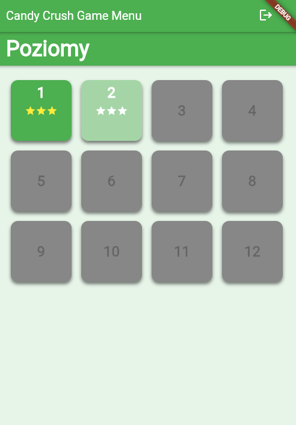
#### 3.4 Rekordy w bazie danych zostały zaktualziowane
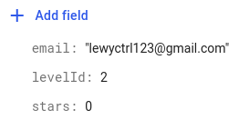

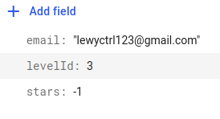
